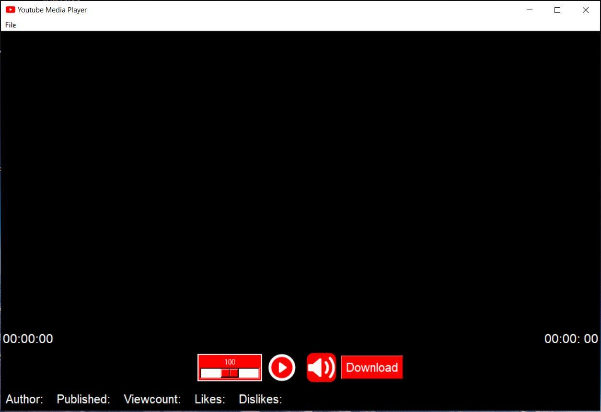

# Youtube-Player
Youtube Media Player is an application that allows you to view any desired Youtube video. The Application is implemented using the Python programming language and the Tkinter GUI. It is a video player that identifies the desired video for playback using the video's web address and displays it. The only requirement for its functionality, i.e., displaying the desired video, is access to the internet.

The application consists of three main parts:
* The graphical user interface (GUI), which is integrated through Tkinter GUI
* The video player, which is realized through the VLC open source library. The library provides many options for working with media files and is suitable for streaming Youtube videos
* The Pafy library, which is used for downloading information about the Youtube video (URL, title, description, etc.) in JSON format

## Features
 
 * Play any Youtube video
 * Simple and intuitive user interface
 * Uses the Pafy and VLC open source libraries for improved performance and functionality

## Getting Started

To get started with the Youtube Media Player application, follow these steps:
* Clone the repository
* Install the required libraries: Pafy and VLC
* Set your own Youtube API key using pafy.set_api_key("apikey").
* Run the application

## Requirements
* Python 3
* Pafy library
* VLC library
